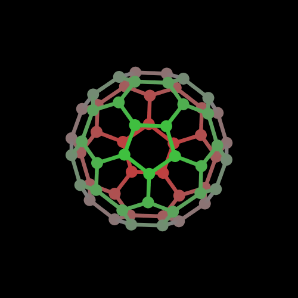
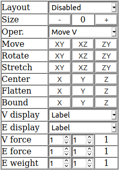
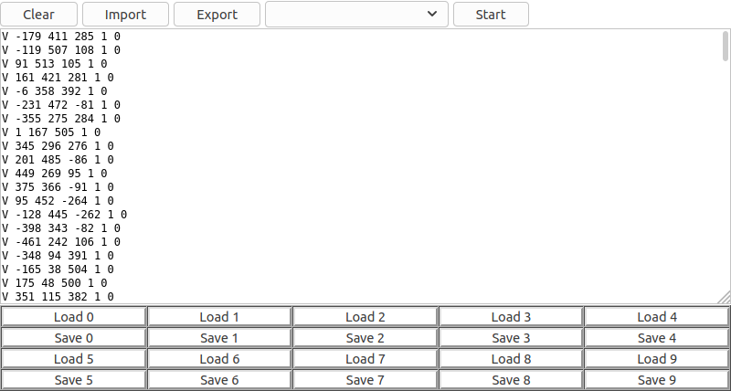
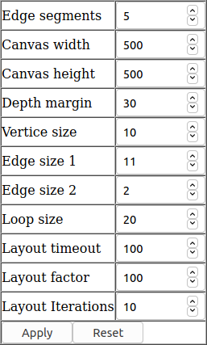
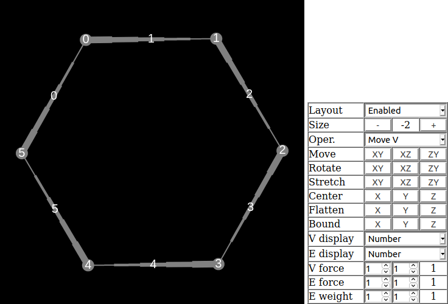
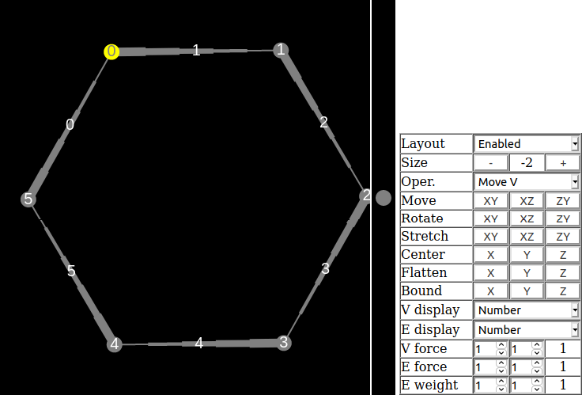
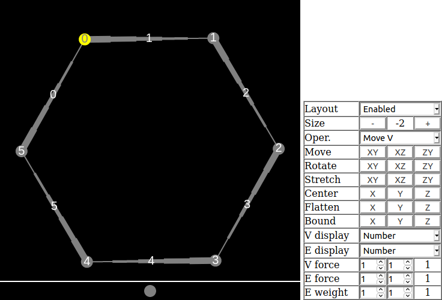

# Overview

GraphVis is simple HTML/JS graph application, which allows to draw and analyze multigraphs with undirected and directed edges\. The graph layout can be automatized or manually set and viewed\. You can use the most common algorithms to process or analyze the graph\.

# Interface

The application interface consists of four elements:

1. **Canvas** \- On the canvas the graph will be drawn\.
2. **Toolbox** \- Used to define and modify graph and view\.
3. **Textbox** \- The text buffer, which is used to liad and save graphs or print output from some algorithms\.
4. **Settings** \- Application settings\.

## Canvas

There is the main element of GraphVis application\. Its displays the graph and reacts for the mouse clicks and movements\.

The depth placement is presented by colors:

* **Red** \- behind the screen surface \(value on Z axis less than 0\)\.
* **Gray** \- on the screen surface\.
* **Green** \- in the front of screen \(value on Z axis greater than 0\)\.

The coordinates are normalized and are from \-1000 to 1000 in all axes\.

The vertices are shown as filled circles, the undirected edges are shown as straight lines, the directed edges are shown as narrowing lines from the begining vertex to the ending vertex\. The loops \(edges connecting the same vertice\) are always undirected\. You can select a vertex by clicking on it\. The selected vertex is indicated by yellow color\.

## Toolbox

The toolbox is next to the canvas ot below the canvas \(depends on display resolution and canvas size\)\.

The toolbar has the following elements:

* **Layout** \- Automated graph layout\.
* **Size** \- Proportional size change of atuomated layout if enabled\.
* **Operation** \- The current operation when you click on the canvas\.
* **Move** \- Move the graph by selected two axes when you drag on the canvas outside the vertices\.
* **Rotate** \- Rotate the graph by selected two axes when you drag on the canvas outside the vertices\.
* **Stretch** \- Stretch the graph by selected two axes when you drag on the canvas outside the vertices
* **Center** \- Center the graph across choosen axis\.
* **Flatten** \- Move all vertices to the 0 value on the choosen axis\.
* **Bound** \- Move all vertices to the range from \-1000 to 1000 across all axis, its moves all invisible vertices, which are outside the canvas\.
* **V display** \- The information, which is displayed on vertices\.
* **E display** \- The information, which is displayed on edges\.
* **V force** \- The numerator and denominator of vertice force factor, which is used in automated layout\.
* **E force** \- The numerator and denominator of edge force factor, which is used in automated layout\. This value are common for edges between the same vertices and not used in loops\.
* **E weight** \- The numerator and denominator of edge weight used in some algorithms\. This value are individual for each edge and used when placing new edges\.

## Textbox

Below the canvas and the toolbox, there is the textbox field with buttons\. This field can be used to save and load graph or get output information from some algorithms\.

Above the txtbox there are the following controls:

* **Clear** \- Clear graph canvas and remove graph from memory\.
* **Import** \- Import graph from textbox, where the textbox contains the exported graph text\.
* **Export** \- Export graph into textbox\.
* **Algorithm list** \- List of graph algorithms\.
* **Start** \- Execute the selected algorithm\.

Below the textbox field, there are 20 buttons in 10 pairs\. Each pair consists of **Save** and **Load** button with the number from 0 to 9\. These buttons allows to save text into local storage and load the saved text\. There is not the same as **Import** and **Export**, there are the way to easily save the text inside the textfield\.

## Settings

The Settings element allows to change display setings\. The values does not affect the graph structure, but there are have important impact to display\.

The settings are following:

* **Edge segments** \- Number of segments used to draw edges\. The higher number makes drawing more accurate, but it can be make slower in large graphs\.
* **Canvas width** \- Canvas width in pixels\. The values not affects the logical value range on X axis, which is between \-1000 and 1000\.
* **Canvas height** \- Canvas height in pixels\. The values not affects the logical value range on Y axis, which is between \-1000 and 1000\.
* **Depth margin** \- Size of Z axis indicator margin when you move vertice across XZ or ZX axes\.
* **Vertice size** \- The radius of vertice circle\.
* **Edge size 1** \- The thickness of the beginning of directed edge\. The undirected edge thickness is the average of both edge sizes\.
* **Edge size 2** \- The thickness of the ending of directed edge\. The undirected edge thickness is the average of both edge sizes\.
* **Loop size** \- The radius of the smallest loop edge\.
* **Edge distance** \- The distance between edges or loops, which are between the same vertices\.
* **Layout timeout** \- The time in milliseconds between two executes of layout algorithm\. This value affects the tempo of automated layering if enabled\.
* **Layout factor** \- The force factor value multiplied by 1000\. Thes value affects the strongness of layout algorithm\. The smaller value is smaller, the layout is more fluent\.
* **Layout iterations** \- The number of iterations in one execute of layout algorithm\. It makes the layout algorithm smoother and can help in cases if layout algorithm causes errors\.

Below the parameters there are two buttons:

* **Apply** \- Applies the settings\. Does not work if automated layering is enabled\. The setting changing will be visible directly\.
* **Reset** \- Clears the saved data of setting\. It requires the application restart to restore the default settings\.

# Creating and editing

You can use the varoius operations in the toolbox to create or edit the graph or multigraph, which have the undirected or directed edges\. After selecting the operation, you have to click on the canvas to do operation as described below\. You can move, rotate and stretch the graph inside the canvas\.

## Operations

The operation are the following and have the following purposes:

* **Move V** \- Move the vertex by drag and drop across two axes, which you choosen by clicking any button in **Move** or **Rotate** or **Stretch** field\.
* **Add V** \- Add the vertex by clicking on the canvas or update the vertex by clicking the vertex in the graph\. The new or updated vertex will have force set in the **V force** field\.
* **Rem V** \- Remove vertex from graph by clicking the vertex in the graph\.
* **Undir E** \- Add undirected edge between two vertices or add a loop edge\. To add edge from selected vertex, click the next vertex\. To add edge from other vertex than selected, click on the canvas outside any vertex to unselect it\. If no vertex is selected, click the first vertex and the second vertex\. The edge will appear\. To add loop, clich the same vertex twice\. The new edge will have the force and weight as set in the **E force** and **E weight** fields\. The edge force is common for all edges between the same vertices and will be aquired from force of last added edge\.
* **Dir E** \- Add directed edge\. This operation work the same ad **Undir E**\. The loop edge will be added as undirected edge\.
* **Rem E** \- Remove edge\. Click the first and second vertice\. If between the vertices are several edge, you will be asked for edge number\. You can remove all edged once\. To remove loop edge, click the same vertex twice\.
* **Lavel V** \- Set vertex label\. Click any vertex in the graph and input the new label\.
* **Label E** \- Set edge label\. Click the first vertex and the second vertex\. If between the vertices are several edges, you will be asked to input the edge number or you can reverse edge display order without changing the labels\. Input the new label\.

## Move, rotate and stretch

You can move, rotate or stretch the graph in any axis\. To do it, click any button in the field **Move**, **Rotate** or **Stretch**\. The button indicates, which two axes will be affected\. To move/rotate/stretch the graph click in the canvas outside any vertex and drag horizontally or vertically\.

The selected axes also affects, in which axes the vertex will be moved when you drag any vertex within **Move V** operation\.

If you recently clicked one of the **XY** buttons, the vertices can be moved as drawn, across X and Y axes while you dragged\.

If you recently clicked one of the **XZ** buttons, the slected vertex can be moved as follows:

* If you drag horizontally, the vertex will be move across X axis as drawn\.
* If you drag vertically, the vertex will move across Z axis and the placement will be shown at the vertical side of the canvas\.

If you recently clicked one of the **ZY** buttons, the slected vertex can be moved as follows:

* If you drag horizontally, the vertex will move across Z axis and the placement will be shown at the horizontal side of the canvas\.
* If you drag vertically, the vertex will be move across Y axis as drawn\.

# Auto layout

GraphVis have implemented the automatically layout **springs and electrons** algorithm\. Each edge are treated as spring which tents to get specified length\. Each pair of vertices repels each other as electrons\.

The algorithm is iterative\. You can enable automatic layout in the **Layout** field\. After some number of iterations, the layout will stabilize\. You can leave the layout enable or disable it\. The resulting graph size can be changed in **Size** field\. The value in the **Size** field are in decibels related to base size\.

You can affect the layout by changing force of vertices and edges\.

# Saving and loading

You can save the graph by clicking the **Export** button in the textbox\. The encoded graph will be printed as text\. You can copy the text to file outside the web browser or you can save the text by clicking the **Save** button at the bottom of the textbox\.

To load graph, which you have in text file, paste the file contents into the textbox and click the **Import** button\. If the graph is saved in local storage, click the **Load** button with apropriate number, after this, click the **Import** button\.

# Algorithms

GraphVis provides some popular graph operations\. To perform any operation, select this operation and click the **Start** button\. The operation marked with **\*** character may take very long time for large graphs\.

## Clear labels

Clear labels of all vertices or all edges\. You will be asked as follows:

* **Vertices?** \- Clear vertex labels\.
* **Edges?** \- Clear edge labels\.

## Number as labels

Set vertex number as label for every label or set edge number as label for every edge\. You will be asked as follows:

* **Vertices?** \- Set vertex labels as numbers\.
* **Edges?** \- Set edge labels as numbers\.

## Labels from V to E

Set edge labels based on vertice labels\. Each edge will have label derived from the both vertices, which the edge connects\. If vertice labels are different, the label will be separated by minus sign\.

## Labels from E to V

Set vertice labels based on edge labels\. Each vertex will have all distinct label from all adjacent edges, separated by comma sign\.

## Complement graph

Convert this graph into complement graph\. The directed edges will have reversed direction, the undirected edges will be removed and if any pair of vertices has no edges, there will be created undirected edge between such vertices\. The loop edges will be processed according the following question:

* **Include loops?** \- If vertex does not have a loop, the loop will be created and if vertex have a loop, the loop will be removed\.

## Line graph

Convert this graph into line graph, where each edge will be presented as vertex\. The edge labels will be preserved\.

## Depth\-first search, Breadth\-first search

Enumerate vertices and edges from the selected vertex according the DFS or BFS algorithm\. Before enumerating, there will be asked the two questions:

* **Ascending order?** \- The adjacent edges from the vertex will be browsed in ascending order, otherwise, the adjacent edges will be browsed in descending order\. This may affects the order of vertices visiting and enumerating, but in both cases, there is the same graph browsing\.
* **Forward direction?** \- The directed edges will be browsed by forward direction, otherwise, the directed edges will be treated as reversed\.

The numbers will be saved as labels\.

## Color V \- largest first, smallest last, saturated lf, brute force

Color the graph vertices be assigning the number to each graph vertex\. You can use one of the following algorithms: 

The vertices will be labeled as color numbers and in the textbox there will be displayed number of used colors\. The number will equal the chomatic number if you use the brute force algorithm, at the other algorithms, the number of used colors may be greater than chromatic numbers\. The direction of the directed edges will be ignored\.

## Color E \- largest first, smallest last, saturated lf, brute force

The graph will be converted to the related line graph in background and there will be colored by the same method as one of **Color V** algorithm\. In the line graph, every edge will be converted to vertex, so there is the possible to use the same algorithm both to color vertices or to color edges\. The edges will be labeled as color numbers and in the textbox there will be displayed number of used colors\. The number will equal the chomatic index if you use the brute force algorithm, at the other algorithms, the number of used colors may be greater than chromatic index\. The direction of the directed edges will be ignored\.

## Paths and cycles of V/E

Search for all possible paths and cycles, which begins or ends on the selected vertex and consists of vertices \(V\) or edges \(E\) from the specified number range\. 

V variant: The same vertex can not repeat in one cycle or path\. This algorithm can be used to find Hamiltonian path or Hamiltonian cycle\.

E variant: The same vertex can repeat in one cycle or path\. This algorithm can be used to find Eulerian path or Eulerian cycle\.

If you select any vertex, there will be searched for all paths and cycles from the selected vertiex, otherwise, all vertices will be analyzed\. You will be asked for:

* **Minimum vertices from 2 to x **\- The minimum number of vertices, which path or cycle can use, the **x** means the number of all vertices \(V only\)\.
* **Maximum vertices from 2 to x **\- The maximum number of vertices, which path or cycle can use, the **x** means the number of all vertices \(V only\)\.
* **Minimum edges from 1 to x **\- The minimum number of edges, which path or cycle can use, the **x** means the number of all edges \(E only\)\.
* **Maximum edges from 1 to x **\- The maximum number of edges, which path or cycle can use, the **x** means the number of all edges \(E only\)\.
* **Search from vertex?** \- This means search for paths from the current vertex to other vertices, otherwise, the paths will be generated from other vertices to the current vertex\. This does not affect to available paths\.
* **Print paths?** \- Print all found paths to the textbox\.
* **Print cycles?** \- Print all found cycles to the textbox\.

The paths and cycles will be printed in the textbox, foe rvery vertex there will be printed number of all found paths or cycles regardless the ansfer for the **Print paths** and **Print cycles** questions\.

Every path or cycle will be printed by vertice and edge sequence, where vertice numbers are in **\(\)** brackets, and edge numbers are in **\[\]** brackets\.

## Connectivity

This operation will be do three elements once:

* Compute number of connected subgraphs and mark them by labeling all vertices and edges by subgraph number label\.
* Mark all cut edges by adding brackets to edge labels\.
* Mark all cut vertices by adding brackets to edge labels\.

The number of found connected subgraphs will be displatyed in the textbox\.

## Minimum spanning tree

Create the minimum spanning tree of the graph using Kruskal's algorithm if no vertex selected or using Prim's algorithm if any vertex is selected\. In the textbox, there will be displayed the total weight of the spanning tree\.

Before searching, there will be asked the question:

* **Ascending order?** \- If yes, the edge list will be browsed ascending, otherwise, the list will be browsed descending\. This may affect to tree layout, but in both cases, the tree should have the same weight\.

In the textbox, there will be printed the weight of the found spanning tree\.

